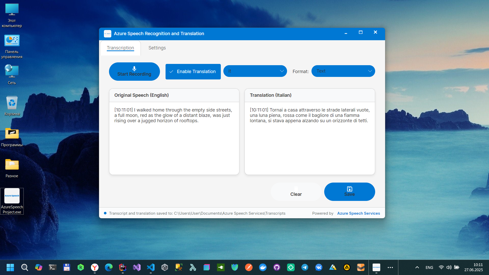
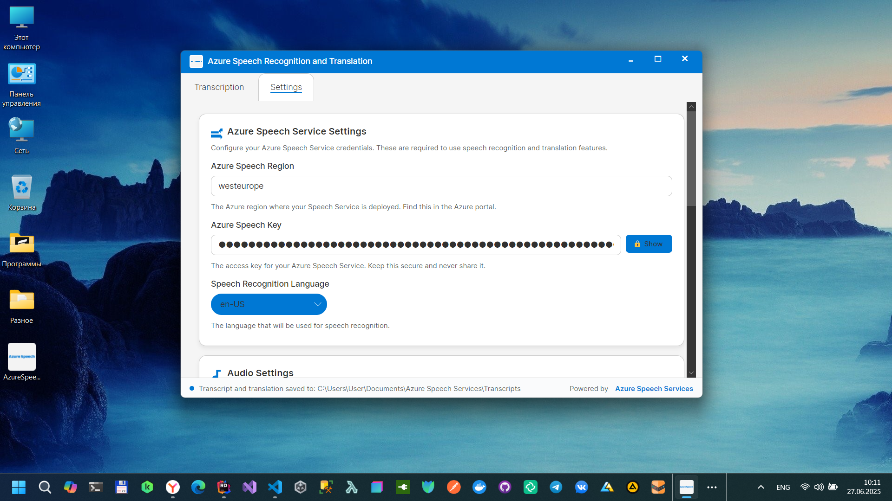
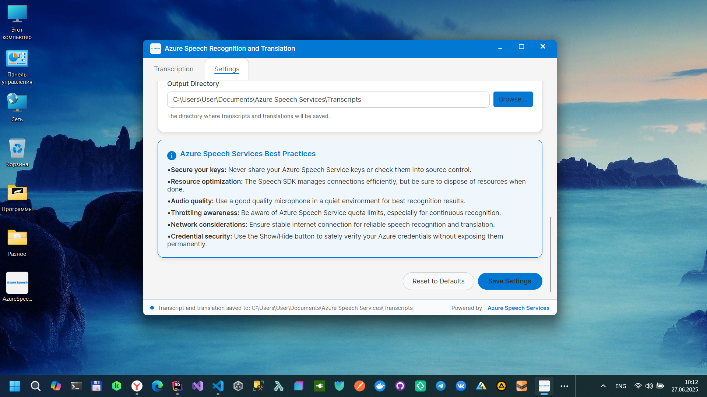

# AzioSpeech

## AzioSpeech Recognition and Translation

A desktop application built with Avalonia UI that provides real-time speech recognition and translation using Azure Speech Services. Convert spoken words into text and translate them into multiple languages with professional-grade accuracy.

## Features

**Real-time Speech Recognition**
- High-quality speech-to-text conversion
- Support for multiple audio formats and sample rates

**Multi-language Translation**
- Real-time translation to 9+ languages
- Support for Russian, Spanish, French, German, Italian, Portuguese, Japanese, Korean, and Chinese.
- Side-by-side original and translated text display

**Flexible Export Options**
- Save transcripts in multiple formats (TXT, JSON, SRT)
- Automatic timestamping for all segments
- Organized file management with custom output directories

**Secure Credential Management**
- Encrypted storage of Azure Speech Service keys

⚙**Advanced Audio Configuration**
- Customizable sample rates (8kHz to 48kHz)
- Bit depth options (8-bit to 32-bit)
- Mono/stereo channel selection
- Optimized for Azure Speech Services (16kHz, 16-bit, mono recommended)

## Prerequisites

### Azure Account Setup

1. **Create an Azure Account**
    - Visit [Azure Portal](https://portal.azure.com)
    - Sign up for a free account or use your existing subscription

2. **Create a Speech Service Resource**
    - Use the Azure Portal:
    - Navigate to "Create a resource"
    - Search for "Speech" and select "Speech Services"
    - Fill in the required information:
     - **Subscription**: Your Azure subscription
     - **Resource Group**: Create new or select existing
     - **Region**: Choose your preferred region (e.g., East US, West Europe)
     - **Name**: Unique name for your service
     - **Pricing tier**: Select appropriate tier (F0 for free tier, S0 for standard)

3. **Get Your Credentials**
    - After deployment, go to your Speech Service resource
    - Navigate to "Keys and Endpoint"
    - Copy one of the keys and the region
    - You'll need these for the application configuration

### System Requirements

- **Operating System**: Windows 11
- **.NET Runtime**: .NET 9.0
- **Microphone**: Any compatible audio input device
- **Internet Connection**: Required for Azure Speech Services

## Configuration

### Initial Setup

1. **Launch the Application**
    - Open the application
    - Navigate to the "Settings" tab

2. **Configure Azure Speech Service**
    - **Region**: Enter your Azure Speech Service region (e.g., `eastus`, `westeurope`)
    - **Key**: Enter your Azure Speech Service key
    - Use the Show/Hide button to verify your key entry

3. **Audio Settings** (Optional)
    - **Sample Rate**: 16000 Hz (recommended for Azure)
    - **Bits Per Sample**: 16 bits (recommended)
    - **Channels**: 1 (mono, recommended)

4. **Output Directory**
    - Click "Browse..." to select where transcripts will be saved
    - Default: `Documents/Azure Speech Services/Transcripts`

5. **Save Settings**
    - Click "Save Settings" to store your configuration

### Advanced Configuration

#### Audio Quality Settings
For optimal Azure Speech Services performance:
- **Sample Rate**: 16 kHz (16000 Hz)
- **Bit Depth**: 16-bit
- **Channels**: Mono (1 channel)

Higher quality settings may not improve accuracy and will use more bandwidth.

#### Supported Languages
- **Speech Recognition**: English (en-US)
- **Translation Targets**: Russian (ru), Spanish (es), French (fr), German (de), Italian (it), Portuguese (pt), Japanese (ja), Korean (ko), Chinese Simplified (zh-Hans)

## Usage

### Basic Transcription

1. **Start Recording**
    - Click the "Start Recording" button
    - Grant microphone permissions if prompted
    - Speak clearly into your microphone

2. **Monitor Progress**
    - Real-time transcription appears in the left panel
    - Status bar shows recording progress

3. **Stop Recording**
    - Click "Stop Recording" when finished
    - Review the transcription results

4. **Save Results**
    - Click "Save" to export your transcript
    - Choose from TXT, JSON, or SRT formats

### Translation Workflow

1. **Enable Translation**
    - Check "Enable Translation" in the control panel
    - Select your target language from the dropdown

2. **Start Recording**
    - Begin recording as normal
    - Translation appears in real-time in the right panel

3. **Export Results**
    - Save both original and translated versions
    - Files are automatically named with language suffixes

## Troubleshooting

### Common Issues

**Authentication Errors**
- Verify your Azure Speech Service key and region
- Ensure your Azure subscription is active
- Check that your Speech Service resource is properly configured

**Audio Issues**
- Confirm microphone permissions are granted
- Test microphone functionality in system settings
- Try different audio quality settings

**Network Connectivity**
- Ensure stable internet connection
- Check firewall settings for outbound HTTPS traffic
- Verify Azure service availability in your region

## Contributing

Contributions are welcome. Please fork the repository and create a pull request with your changes.

## Author

Bohdan Harabadzhyu

## License

[MIT](https://choosealicense.com/licenses/mit/)

*This application is not affiliated with Microsoft Corporation. Azure and Azure Speech Services are registered trademarks of Microsoft Corporation.*

## Microsoft Store

## SourceForge

## YouTube Review

📺 Watch Video Review

